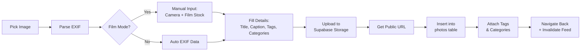
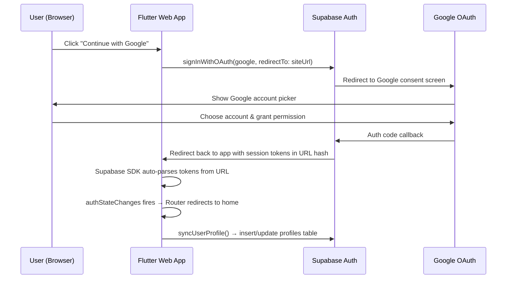

# E4. Photo Upload + Film Mode, Security Hardening & Google Login

Kế hoạch triển khai ba mục tiêu song song: hoàn thiện luồng Upload ảnh (bao gồm chế độ "Film Shot"), rà soát bảo mật toàn diện, và tích hợp **Google OAuth Login** cho Luxlog.

---

## User Review Required

> [!IMPORTANT]
> **Supabase Storage Bucket**: Cần tạo một Storage bucket tên `photos` trên Supabase Dashboard (Settings → Storage) với policy cho phép authenticated users upload. Bạn đã tạo bucket này chưa?

> [!IMPORTANT]
> **Film Photography fields**: Plan đề xuất thêm 2 cột mới vào bảng `photos` (`film_stock TEXT`, `film_camera TEXT`). Điều này yêu cầu chạy migration SQL trên Supabase. Bạn đồng ý không?

> [!WARNING]
> **Security headers**: Hiện tại `vercel.json` không có security headers nào. Plan sẽ thêm CSP, X-Frame-Options, etc. Điều này có thể ảnh hưởng nếu bạn embed site ở nơi khác.

---

## Phần 1: E4 — Implement Photo Upload + Film Mode

### Tổng quan luồng Upload


---

### 1.1 Database Migration — Film Fields

#### [NEW] `supabase/migrations/003_film_fields.sql`
Thêm cột cho film photography:
```sql
ALTER TABLE public.photos ADD COLUMN film_stock TEXT;
ALTER TABLE public.photos ADD COLUMN film_camera TEXT;
ALTER TABLE public.photos ADD COLUMN is_film BOOLEAN DEFAULT false;
ALTER TABLE public.photos ADD COLUMN caption TEXT;
ALTER TABLE public.photos ADD COLUMN license TEXT DEFAULT 'CC BY 4.0';
ALTER TABLE public.photos ADD COLUMN allow_download BOOLEAN DEFAULT true;
```

---

### 1.2 Update PhotoModel

#### [MODIFY] [photo_model.dart](file:///Users/uyn/Desktop/An/35mm/luxlog/lib/shared/models/photo_model.dart)
Thêm các field mới vào Freezed model:
- `filmStock` (`film_stock`) — Tên cuộn film (VD: "Kodak Portra 400", "Fuji Superia 400")
- `filmCamera` (`film_camera`) — Tên máy film (VD: "Contax G2", "Nikon FM2")
- `isFilm` (`is_film`) — Boolean flag
- `caption` — Mô tả ngắn
- `license` — Loại license
- `allowDownload` (`allow_download`) — Cho phép tải

---

### 1.3 Implement `uploadPhoto()` in Repository

#### [MODIFY] [photo_repository.dart](file:///Users/uyn/Desktop/An/35mm/luxlog/lib/features/gallery/data/repositories/photo_repository.dart)
Thay thế placeholder bằng logic thật:

```dart
Future<String> uploadPhoto({
  required Uint8List fileBytes,
  required String fileName,
  required String title,
  String? caption,
  String? license,
  bool allowDownload = true,
  // EXIF (auto-parsed or manual for film)
  bool isFilm = false,
  String? filmStock,
  String? filmCamera,
  String? camera,
  String? lens,
  int? iso,
  String? aperture,
  String? shutterSpeed,
  double? focalLength,
  double? latitude,
  double? longitude,
  bool shareGps = false,
}) async {
  final userId = _client.auth.currentUser?.id;
  if (userId == null) throw const AuthException();
  
  // 1. Upload bytes to Supabase Storage bucket "photos"
  final path = 'uploads/$userId/${DateTime.now().millisecondsSinceEpoch}_$fileName';
  await _client.storage.from('photos').uploadBinary(path, fileBytes, ...);
  
  // 2. Get public URL
  final imageUrl = _client.storage.from('photos').getPublicUrl(path);
  
  // 3. Insert row into photos table
  final response = await _client.from('photos').insert({...}).select().single();
  
  return response['id'];
}
```

**Key decisions:**
- Dùng `uploadBinary()` thay vì `upload()` vì Flutter Web không hỗ trợ `File` (dart:io)
- Storage path format: `uploads/{userId}/{timestamp}_{filename}` → tránh trùng tên
- GPS chỉ lưu khi `shareGps = true` → bảo vệ privacy

---

### 1.4 Add Upload Provider

#### [MODIFY] [photo_provider.dart](file:///Users/uyn/Desktop/An/35mm/luxlog/lib/features/gallery/providers/photo_provider.dart)
Thêm provider wrapper cho upload:
```dart
@riverpod
Future<String> uploadPhoto(UploadPhotoRef ref, {...params}) {
  final repo = ref.watch(photoRepositoryProvider);
  return repo.uploadPhoto(...);
}
```

---

### 1.5 Update Upload Screen — Film Mode UI

#### [MODIFY] [upload_screen.dart](file:///Users/uyn/Desktop/An/35mm/luxlog/lib/features/gallery/presentation/upload_screen.dart)

**Thay đổi chính:**

1. **Convert to `ConsumerStatefulWidget`** — để dùng Riverpod providers
2. **Thêm Film toggle** — Checkbox/Switch "Shot on Film" ngay dưới EXIF section
3. **Film input fields** (hiện khi `_isFilm = true`):
   - `_filmCameraCtrl` — TextField "Film Camera" (VD: "Contax G2")
   - `_filmStockCtrl` — TextField "Film Stock" (VD: "Kodak Portra 400")
   - Hiển thị với animation slide-down khi toggle bật
4. **Wire `_upload()` method** — thay `Future.delayed` bằng logic thật:
   ```dart
   Future<void> _upload() async {
     setState(() => _currentStep = 2);
     try {
       final photoId = await ref.read(photoRepositoryProvider).uploadPhoto(
         fileBytes: _selectedImageBytes!,
         fileName: _selectedImage!.name,
         title: _titleCtrl.text,
         caption: _captionCtrl.text,
         isFilm: _isFilm,
         filmStock: _isFilm ? _filmStockCtrl.text : null,
         filmCamera: _isFilm ? _filmCameraCtrl.text : null,
         // ... EXIF fields from _parsedExif
       );
       // Attach tags & categories
       // Invalidate feed
       ref.invalidate(photoFeedProvider);
       if (mounted) Navigator.of(context).pop();
     } catch (e) {
       // Show error, go back to step 1
     }
   }
   ```
5. **File size validation** — Giới hạn 20MB trước khi upload
6. **Upload progress** — Hiển thị progress indicator (nếu Supabase SDK hỗ trợ)

**UI Mockup cho Film section:**
```
┌─────────────────────────────────────┐
│ ▌ CAMERA DATA (EXIF)                │
│  [No EXIF data found]               │
│                                     │
│ ┌─────────────────────────────────┐ │
│ │ 🎞️  Shot on Film           [✓] │ │
│ └─────────────────────────────────┘ │
│                                     │
│ ▌ FILM DETAILS                      │
│  ┌──────────────────────────────┐   │
│  │ 📷 Film Camera               │   │
│  │ Contax G2                    │   │
│  └──────────────────────────────┘   │
│  ┌──────────────────────────────┐   │
│  │ 🎞️ Film Stock                │   │
│  │ Kodak Portra 400             │   │
│  └──────────────────────────────┘   │
└─────────────────────────────────────┘
```

---

### 1.6 Update ExifInfo Model

#### [MODIFY] [exif_badge.dart](file:///Users/uyn/Desktop/An/35mm/luxlog/lib/shared/widgets/exif_badge.dart)
Thêm `filmStock` và `filmCamera` vào `ExifInfo` class:
```dart
class ExifInfo {
  // ... existing fields
  final String? filmStock;
  final String? filmCamera;
  final bool isFilm;
}
```

---

## Phần 2: Security Audit & Hardening

### 🔍 Kết quả Rà soát

| Hạng mục | Mức độ | Phát hiện |
|:---|:---:|:---|
| **RLS Policies** | 🟡 Trung bình | Thiếu DELETE policy cho `photos`, `comments`, `likes`. Thiếu INSERT policy cho `comments`, `likes`. `follows` table chưa có RLS policies |
| **Input Validation** | 🔴 Cao | Signup: không validate email format, password strength. Upload: không giới hạn file size. Comment: không sanitize input |
| **Secrets Management** | ✅ Tốt | Sử dụng `--dart-define`, không hardcode |
| **Security Headers** | 🔴 Cao | `vercel.json` không có headers: CSP, X-Frame-Options, HSTS |
| **Debug Logging** | 🟡 Trung bình | `print()` còn trong production code (`supabase_service.dart`) |
| **Error Exposure** | 🟡 Trung bình | `e.toString()` hiển thị raw exception cho user (có thể leak internal info) |
| **Photo DELETE** | 🔴 Cao | Thiếu RLS policy cho DELETE trên photos — user không thể xóa ảnh của mình, nhưng nếu thêm API cũng không có policy bảo vệ |
| **Storage Policies** | 🟡 Chưa rõ | Cần verify bucket `photos` có RLS đúng trên Supabase Dashboard |

---

### 2.1 Fix Missing RLS Policies

#### [NEW] `supabase/migrations/004_security_rls.sql`

```sql
-- Photos: DELETE policy (chỉ owner)
CREATE POLICY "Users can delete own photos" ON public.photos
  FOR DELETE USING (auth.uid() = user_id);

-- Comments: INSERT + DELETE
CREATE POLICY "Authenticated users can comment" ON public.comments
  FOR INSERT WITH CHECK (auth.uid() = user_id);
CREATE POLICY "Users can delete own comments" ON public.comments
  FOR DELETE USING (auth.uid() = user_id);

-- Likes: INSERT + DELETE
CREATE POLICY "Authenticated users can like" ON public.likes
  FOR INSERT WITH CHECK (auth.uid() = user_id);
CREATE POLICY "Authenticated users can unlike" ON public.likes
  FOR DELETE USING (auth.uid() = user_id);

-- Comments + Likes: SELECT
CREATE POLICY "Comments viewable by all" ON public.comments
  FOR SELECT USING (true);
CREATE POLICY "Likes viewable by all" ON public.likes
  FOR SELECT USING (true);

-- Follows: full RLS
ALTER TABLE public.follows ENABLE ROW LEVEL SECURITY;
CREATE POLICY "Follows viewable by all" ON public.follows
  FOR SELECT USING (true);
CREATE POLICY "Users can follow" ON public.follows
  FOR INSERT WITH CHECK (auth.uid() = follower_id);
CREATE POLICY "Users can unfollow" ON public.follows
  FOR DELETE USING (auth.uid() = follower_id);

-- Portfolios: SELECT (public), INSERT, UPDATE, DELETE
CREATE POLICY "Public portfolios viewable" ON public.portfolios
  FOR SELECT USING (is_public = true OR auth.uid() = user_id);
CREATE POLICY "Users can create portfolios" ON public.portfolios
  FOR INSERT WITH CHECK (auth.uid() = user_id);
CREATE POLICY "Users can delete own portfolios" ON public.portfolios
  FOR DELETE USING (auth.uid() = user_id);

-- Portfolio Projects
CREATE POLICY "Portfolio projects viewable" ON public.portfolio_projects
  FOR SELECT USING (EXISTS (
    SELECT 1 FROM public.portfolios
    WHERE id = portfolio_id AND (is_public = true OR user_id = auth.uid())
  ));
CREATE POLICY "Users can manage own projects" ON public.portfolio_projects
  FOR INSERT WITH CHECK (EXISTS (
    SELECT 1 FROM public.portfolios WHERE id = portfolio_id AND user_id = auth.uid()
  ));
CREATE POLICY "Users can update own projects" ON public.portfolio_projects
  FOR UPDATE USING (EXISTS (
    SELECT 1 FROM public.portfolios WHERE id = portfolio_id AND user_id = auth.uid()
  ));
CREATE POLICY "Users can delete own projects" ON public.portfolio_projects
  FOR DELETE USING (EXISTS (
    SELECT 1 FROM public.portfolios WHERE id = portfolio_id AND user_id = auth.uid()
  ));

-- Tags: INSERT (any authenticated user can create tags)
CREATE POLICY "Authenticated users can create tags" ON public.tags
  FOR INSERT WITH CHECK (auth.uid() IS NOT NULL);
```

---

### 2.2 Add Security Headers

#### [MODIFY] [vercel.json](file:///Users/uyn/Desktop/An/35mm/luxlog/vercel.json)

```json
{
  "buildCommand": "./vercel-build.sh",
  "outputDirectory": "build/web",
  "framework": null,
  "headers": [
    {
      "source": "/(.*)",
      "headers": [
        { "key": "X-Content-Type-Options", "value": "nosniff" },
        { "key": "X-Frame-Options", "value": "DENY" },
        { "key": "X-XSS-Protection", "value": "1; mode=block" },
        { "key": "Referrer-Policy", "value": "strict-origin-when-cross-origin" },
        { "key": "Permissions-Policy", "value": "camera=(self), microphone=(), geolocation=(self)" },
        {
          "key": "Content-Security-Policy",
          "value": "default-src 'self'; script-src 'self' 'unsafe-inline' 'unsafe-eval' https://_vercel/; style-src 'self' 'unsafe-inline' https://fonts.googleapis.com; font-src 'self' https://fonts.gstatic.com; img-src 'self' data: blob: https://*.supabase.co https://picsum.photos https://images.unsplash.com https://i.pravatar.cc; connect-src 'self' https://*.supabase.co wss://*.supabase.co;"
        },
        { "key": "Strict-Transport-Security", "value": "max-age=63072000; includeSubDomains; preload" }
      ]
    }
  ]
}
```

---

### 2.3 Input Validation

#### [MODIFY] [signup_screen.dart](file:///Users/uyn/Desktop/An/35mm/luxlog/lib/features/auth/presentation/signup_screen.dart)
Thêm validation trước khi gọi `signUp()`:
- **Email format**: RegExp check `r'^[\w-\.]+@([\w-]+\.)+[\w-]{2,4}$'`
- **Password strength**: Tối thiểu 8 ký tự, ít nhất 1 chữ hoa + 1 số
- **Display name**: Không rỗng, max 50 ký tự

#### [MODIFY] [upload_screen.dart](file:///Users/uyn/Desktop/An/35mm/luxlog/lib/features/gallery/presentation/upload_screen.dart)
- **File size check**: `if (bytes.length > 20 * 1024 * 1024) → show error "Max 20MB"`
- **Title length**: Max 200 ký tự
- **Caption length**: Max 2000 ký tự
- **Tag count**: Max 30 tags

---

### 2.4 Sanitize Error Messages

#### [MODIFY] [login_screen.dart](file:///Users/uyn/Desktop/An/35mm/luxlog/lib/features/auth/presentation/login_screen.dart) & [signup_screen.dart](file:///Users/uyn/Desktop/An/35mm/luxlog/lib/features/auth/presentation/signup_screen.dart)
Thay `e.toString()` bằng user-friendly message:
```dart
} catch (e) {
  final message = e is AppException ? e.message : 'Something went wrong. Please try again.';
  ScaffoldMessenger.of(context).showSnackBar(SnackBar(content: Text(message)));
}
```

---

### 2.5 Remove Debug Prints

#### [MODIFY] [supabase_service.dart](file:///Users/uyn/Desktop/An/35mm/luxlog/lib/core/services/supabase_service.dart)
Thay `print()` bằng `debugPrint()` (chỉ hiển thị ở debug mode) hoặc xóa hoàn toàn.

---

## Phần 3: Google Login với Supabase

### Tổng quan luồng Google OAuth (Web)


---

### 3.1 Cấu hình Google Cloud Console (Manual)

Đã có OAuth Client credentials:
- **Client ID**: `<REDACTED_CLIENT_ID>`
- **Client Secret**: `<REDACTED_CLIENT_SECRET>`
- **Project ID**: `dauntless-glow-493609-h6`

> [!IMPORTANT]
> **Bước thủ công trên Google Cloud Console** (https://console.cloud.google.com/apis/credentials):
> 1. Mở OAuth Client `15408380458-...` → tab **"Authorized redirect URIs"**
> 2. Thêm redirect URI của Supabase: `https://<YOUR_SUPABASE_PROJECT_REF>.supabase.co/auth/v1/callback`
>    - Lấy project ref từ Supabase Dashboard → Settings → General
> 3. Trong **"Authorized JavaScript origins"**, thêm:
>    - `https://<YOUR_VERCEL_DOMAIN>` (ví dụ: `https://luxlog.vercel.app`)
>    - `http://localhost:3000` (cho dev)
> 4. Trong OAuth consent screen, đảm bảo đã thêm scope: `email`, `profile`, `openid`

---

### 3.2 Cấu hình Supabase Dashboard (Manual)

> [!IMPORTANT]
> **Bước thủ công trên Supabase Dashboard** (Authentication → Providers → Google):
> 1. Enable Google provider
> 2. Paste **Client ID**: `<REDACTED_CLIENT_ID>`
> 3. Paste **Client Secret**: `<REDACTED_CLIENT_SECRET>`
> 4. **Redirect URL** (copy từ Supabase dashboard) → dán vào Google Cloud Console ở bước 3.1
> 5. Trong Supabase → Authentication → URL Configuration:
>    - **Site URL**: `https://<YOUR_VERCEL_DOMAIN>` (trang chủ app)
>    - **Redirect URLs** (whitelist): thêm cả `https://<YOUR_VERCEL_DOMAIN>/**` và `http://localhost:3000/**`

---

### 3.3 Refactor `signInWithGoogle()` — Web Redirect Flow

#### [MODIFY] [auth_repository.dart](file:///Users/uyn/Desktop/An/35mm/luxlog/lib/features/auth/data/repositories/auth_repository.dart)

Hiện tại `signInWithGoogle()` dùng `signInWithOAuth()` mặc định, **nhưng thiếu `redirectTo` parameter**. Trên web, Supabase OAuth sẽ redirect về Site URL sau khi login. Cần chỉ định rõ `redirectTo` để control flow:

```dart
// Social OAuth
Future<void> signInWithGoogle() async {
  try {
    await _client.auth.signInWithOAuth(
      OAuthProvider.google,
      redirectTo: _getRedirectUrl(),  // ← NEW
    );
    // Note: on Web, this triggers a full page redirect.
    // The session is auto-restored when the page reloads.
    // syncUserProfile will be handled by the auth state listener.
  } on supa.AuthException catch (e, stackTrace) {
    throw AuthException(e.message, cause: e, stackTrace: stackTrace);
  } catch (e, stackTrace) {
    throw AuthException(
      'Google sign in failed',
      cause: e,
      stackTrace: stackTrace,
    );
  }
}

/// Returns the redirect URL based on the current platform.
String? _getRedirectUrl() {
  // On web, redirect back to the current origin
  // Supabase will append the auth tokens as URL hash fragments
  if (kIsWeb) {
    return Uri.base.origin;
  }
  return null; // On mobile, use deep link (future)
}
```

**Key points:**
- Trên Web, `signInWithOAuth` sẽ trigger **full page redirect** tới Google → quay lại app
- Supabase JS SDK tự parse tokens từ URL hash (`#access_token=...&refresh_token=...`)
- `syncUserProfile()` cần chạy sau khi user quay lại, via auth state listener (không phải inline)

---

### 3.4 Add Auth State Listener for Profile Sync

#### [MODIFY] [auth_provider.dart](file:///Users/uyn/Desktop/An/35mm/luxlog/lib/features/auth/providers/auth_provider.dart)

Thêm listener auto-sync profile khi login thành công (bao gồm OAuth return):

```dart
@riverpod
Stream<AuthState> authState(AuthStateRef ref) {
  final repository = ref.watch(authRepositoryProvider);
  final stream = repository.authStateChanges;
  
  // Listen for sign-in events to auto-sync profile
  ref.listen(authStateProvider, (prev, next) {
    next.whenData((state) async {
      if (state.event == AuthChangeEvent.signedIn && state.session?.user != null) {
        try {
          final datasource = ref.read(authRemoteDataSourceProvider);
          await datasource.syncUserProfile(state.session!.user);
        } catch (_) {
          // Profile sync is best-effort; don't block login
        }
      }
    });
  });
  
  return stream;
}
```

---

### 3.5 Remove Facebook OAuth Placeholder

#### [MODIFY] [auth_repository.dart](file:///Users/uyn/Desktop/An/35mm/luxlog/lib/features/auth/data/repositories/auth_repository.dart)

Xóa `signInWithFacebook()` vì chưa có Facebook App ID. Giữ lại code nhưng mark `@Deprecated` hoặc xóa hoàn toàn.

#### [MODIFY] [login_screen.dart](file:///Users/uyn/Desktop/An/35mm/luxlog/lib/features/auth/presentation/login_screen.dart)

Xóa Facebook button khỏi UI:
```diff
- const SizedBox(height: 10),
- _SocialButton(
-   icon: Icons.facebook,
-   label: 'Continue with Facebook',
-   onTap: _signInWithFacebook,
- ),
```

---

### 3.6 Update CSP Header cho Google OAuth

#### [MODIFY] [vercel.json](file:///Users/uyn/Desktop/An/35mm/luxlog/vercel.json)

Thêm Google domains vào CSP `connect-src` và `script-src`:
```diff
- connect-src 'self' https://*.supabase.co wss://*.supabase.co;
+ connect-src 'self' https://*.supabase.co wss://*.supabase.co https://accounts.google.com https://oauth2.googleapis.com;
```

Thêm `form-action` để cho phép OAuth redirect:
```diff
+ form-action 'self' https://accounts.google.com https://*.supabase.co;
```

---

### 3.7 Handle OAuth Redirect in Router

#### [MODIFY] [router.dart](file:///Users/uyn/Desktop/An/35mm/luxlog/lib/app/router.dart)

Sau khi Google OAuth redirect về, URL sẽ có dạng `https://luxlog.vercel.app/#access_token=...`. Supabase SDK tự handle phần này, nhưng router redirect cần xử lý đúng:

```dart
redirect: (context, state) {
  final session = SupabaseService.client.auth.currentSession;
  final isLoggingIn = state.matchedLocation == '/login' || state.matchedLocation == '/signup';

  // After OAuth redirect, session might be available now
  if (session != null && isLoggingIn) {
    return '/';
  }

  // Protected routes
  const protectedPrefixes = ['/upload', '/notifications'];
  final isProtected = protectedPrefixes.any((p) => state.matchedLocation.startsWith(p));
  if (session == null && isProtected) {
    return '/login';
  }

  return null;
},
```

Router hiện tại đã handle đúng — không cần thay đổi lớn. Chỉ cần đảm bảo `SupabaseService.client.auth.currentSession` trả về session đúng sau OAuth redirect.

---

### 3.8 Add Google Client ID to Env (Optional — for native mobile later)

#### [MODIFY] [env.dart](file:///Users/uyn/Desktop/An/35mm/luxlog/lib/core/config/env.dart)

```dart
class Env {
  static const String supabaseUrl = String.fromEnvironment('SUPABASE_URL', defaultValue: '');
  static const String supabaseAnonKey = String.fromEnvironment('SUPABASE_ANON_KEY', defaultValue: '');
  // Google OAuth — only needed for native mobile (google_sign_in package)
  // On Web, OAuth redirects are handled entirely by Supabase
  static const String googleClientId = String.fromEnvironment('GOOGLE_CLIENT_ID', defaultValue: '');

  static bool get hasSupabaseConfig {
    return supabaseUrl.isNotEmpty && supabaseAnonKey.isNotEmpty;
  }
}
```

> [!NOTE]
> Trên **Web**, Google Client ID **không cần truyền vào Flutter app**.
> Supabase server-side sử dụng Client ID/Secret đã cấu hình ở Dashboard.
> `GOOGLE_CLIENT_ID` env var chỉ cần thiết nếu sau này implement native mobile login (dùng `google_sign_in` package).

---

## Thứ tự Thực hiện

| Bước | Công việc | Ước tính |
|:---:|:---|:---:|
| **Phần 1: Photo Upload** | | |
| 1 | Tạo migration `003_film_fields.sql` | 5 phút |
| 2 | Update `PhotoModel` + run `build_runner` | 10 phút |
| 3 | Update `ExifInfo` model (thêm film fields) | 5 phút |
| 4 | Implement `uploadPhoto()` trong `PhotoRepository` | 15 phút |
| 5 | Update `photo_provider.dart` | 5 phút |
| 6 | Update `upload_screen.dart` (Film UI + wire upload) | 25 phút |
| **Phần 2: Security** | | |
| 7 | Tạo migration `004_security_rls.sql` | 10 phút |
| 8 | Update `vercel.json` (security headers + Google CSP) | 5 phút |
| 9 | Add input validation (signup + upload) | 15 phút |
| 10 | Sanitize error messages | 10 phút |
| 11 | Remove debug prints | 2 phút |
| **Phần 3: Google Login** | | |
| 12 | ⚙️ Cấu hình Google Cloud Console (manual) | 10 phút |
| 13 | ⚙️ Cấu hình Supabase Dashboard — enable Google provider | 5 phút |
| 14 | Refactor `signInWithGoogle()` + add `_getRedirectUrl()` | 10 phút |
| 15 | Add auth state listener for profile sync | 10 phút |
| 16 | Remove Facebook placeholder / Update Login UI | 5 phút |
| 17 | Update CSP headers trong `vercel.json` | 5 phút |
| 18 | Update `env.dart` (optional `GOOGLE_CLIENT_ID`) | 2 phút |
| **Verify** | | |
| 19 | Build & verify end-to-end | 15 phút |
| **Tổng** | | **~2.5 giờ** |

---

## Verification Plan

### Automated
- `flutter build web --release` — Ensure no compilation errors
- `flutter analyze` — No new errors/warnings introduced

### Manual — Photo Upload
- [ ] Mở Upload screen → chọn ảnh → EXIF tự parse
- [ ] Toggle "Film" → input fields xuất hiện
- [ ] Nhấn Share → ảnh upload lên Supabase Storage
- [ ] Kiểm tra row mới trong bảng `photos`

### Manual — Security
- [ ] Verify security headers trên [securityheaders.com](https://securityheaders.com)
- [ ] Test RLS: User A không thể DELETE ảnh User B (via Supabase Dashboard)

### Manual — Google Login
- [ ] Trên trang Login, click "Continue with Google"
- [ ] Redirect sang Google consent screen → chọn tài khoản
- [ ] Redirect về app → session tự restore → vào trang chủ
- [ ] Kiểm tra bảng `profiles` có row mới với thông tin từ Google (tên, avatar)
- [ ] Sign out → sign in lại bằng Google → không tạo duplicate profile
- [ ] Test trên Incognito mode (đảm bảo không dựa vào cookie cũ)

---

## Open Questions

> [!IMPORTANT]
> 1. **Storage bucket `photos`** đã được tạo trên Supabase Dashboard chưa? Cần bucket policies cho phép authenticated upload.
> 2. **Film Stock suggestions**: Có muốn tạo một danh sách preset film phổ biến (Portra 400, Tri-X 400, Superia 400...) để autocomplete không? Hay chỉ cần textbox tự do?
> 3. **Max file size**: 20MB có phù hợp không? Ảnh film scan thường lớn (30-50MB TIFF). Nếu cần hỗ trợ TIFF, cần tăng limit.

> [!WARNING]
> 4. **Vercel domain**: Cần biết chính xác URL production của Luxlog trên Vercel (ví dụ: `luxlog.vercel.app`) để cấu hình Google Cloud Console redirect URI và Supabase Site URL. Bạn cho mình URL production nhé?
> 5. **Facebook Login**: Hiện tại nút Facebook trên Login screen chưa hoạt động (chưa có App ID). Nên xóa hoặc ẩn nút Facebook không?
